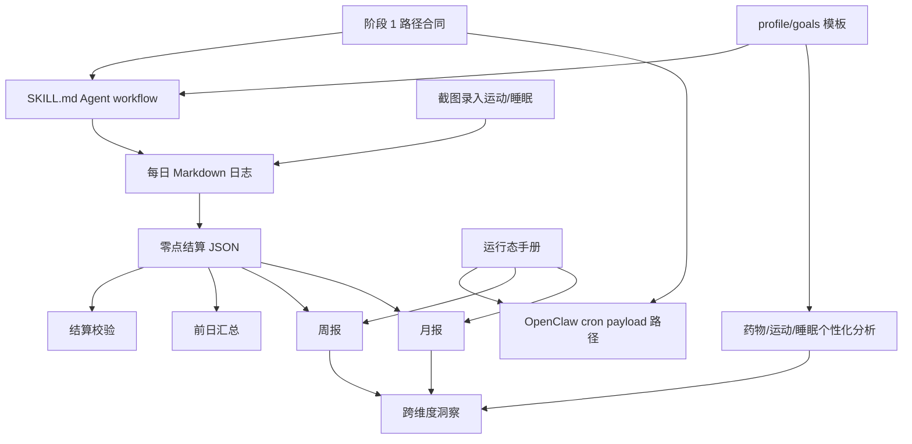

# 小卡健康 Agent 项目路线图清单

> 最近复核：2026-05-27 CST
> 本轮仓库集成基线：`codex/xiaoka-abc-autonomous` worktree 集成 A/B/C；合并后以 `main` 当前 commit 为准
> 本轮运行态边界：不运行 OpenClaw cron、不修改 `jobs.json`、不写个人 runtime 数据、不触发 Telegram
> 远端运行态抽查基线：OpenClaw 中五条小卡 `cron` 任务均已启用，最近只读复核状态均为 `ok`
> 本文件是仓库侧计划真相层。OpenClaw 运行态真相层仍是 Mac Mini 上的 `~/.openclaw/cron/jobs.json`。

## 文档语言约定

- [x] 本仓库后续计划、路线图、复盘、交接文档默认使用中文。
- [x] 技术名词、文件名、路径、命令、错误文本、配置键名保持原文。
- [x] 若引用旧英文模板，只取结构，不保留英文叙述。

## 资料来源

- 当前仓库文件：
  - `README.md`
  - `docs/PRD.md`
  - `SKILL.md`
  - `docs/phase1-minimum-contract.md`
  - `docs/data-schema.md`
  - `docs/knowledge-base-sources.md`
  - `docs/openclaw-runtime.md`
  - `docs/report-automation.md`
  - `plans/phase3a-c8-runtime-smoke.md`
  - `plans/phase4a-readiness-assessment.md`
  - `docs/superpowers/plans/2026-05-13-xiaoka-phase2b-runtime.md`
  - `deploy/openclaw-setup.md`
  - `scripts/README.md`
- 旧 PRD 与旧计划：
  - `/Users/rayli/health-coach/docs/PRD-xiaoka-health-agent.md`
  - `/Users/rayli/health-coach/docs/superpowers/plans/2026-03-25-xiaoka-phase1.md`
- 本次审计已核实事项：
  - `references/cn-food-db.json` 当前为 `1657` 条记录；`README.md` 与 `docs/knowledge-base-sources.md` 已从旧数值 `1677` 修正。
  - `SKILL.md` 当前仍在旧约束 `<=200` 行内。
  - OpenClaw 中小卡 `周报` 与 `月报` cron 任务已创建、启用，并完成零覆盖场景手动验证；2026-05-24 复核时五条 cron 最近状态均为 `ok`。
  - 2026-05-24 本地与 Mac Mini workspace 已同步到 `8f24546`；初次同步时 Mac Mini 直连 GitHub 失败，先通过 `git bundle` 经 SSH 同步。
  - 2026-05-24 Phase 2B synthetic runtime 非零验证已通过：周报覆盖率 `3/7`、月报覆盖率 `3/30`，两者 run status 均为 `ok` 且 summary 非 `NO_REPLY`；generated 报告已归档到 `/Users/ray/.openclaw/backups/xiaoka-phase2b-synthetic-20260524-195710/generated`，synthetic JSON 已清理、原零覆盖报告已恢复。
  - 2026-05-27 只读复核：本地 `main`、`origin/main`、Mac Mini workspace 均处于同一 repo 基线；五条 `xiaoka` cron 均 enabled，最近运行状态均为 `ok`；本次 A/B/C 集成不运行 cron、未写 runtime、未触发 Telegram announce。
  - Mac Mini 当前 `xiaoka` 模型为 `openai/gpt-5.4`；公开模型推荐仍需在 Phase 4A 中重写为能力要求，而不是固定推荐某个旧模型。

## 真相层边界

- [x] **仓库真相层**：`/Users/rayli/xiaoka-health-agent` 中的 Markdown/JSON Agent 包。
- [x] **GitHub 同步真相层**：本地修改应先提交并推送，再让 Mac Mini 执行 `git pull --ff-only origin main`。
- [x] **OpenClaw 工作区真相层**：Mac Mini 上的 `~/.openclaw/workspace-xiaoka`。
- [x] **OpenClaw 运行态真相层**：cron payload 与 schedule 存在 `~/.openclaw/cron/jobs.json`；`git pull` 不会更新它。
- [x] **用户健康数据真相层**：被忽略的运行时文件：`config/profile.md`、`config/goals.md`、`workspace/`。
- [x] **版本化运行态规格**：现有 cron schedule、payload 合同、备份与验证步骤已写入 `docs/openclaw-runtime.md`。继续改运行态前仍应先按该文档备份。

## 产品意图

- [x] 小卡是 AI 健康教练 Agent，不是单纯热量记录器。
- [x] 数据本地优先：健康数据放在 `config/` 与 `workspace/`。
- [x] 医学分析层：体检/血检、补剂、GLP-1、运动、睡眠、趋势分析。
- [x] 输入方式面向真实使用：文字、图片/截图、Telegram/OpenClaw 对话。
- [x] 安全边界明确：不做诊断，不开处方；医学建议必须附免责声明。
- [ ] 自动化闭环尚未完整：日结算、周报、月报运行态已启用，零覆盖与 synthetic 非零场景已验证；Phase 2C 截图录入已有 synthetic mapping fixture 验证，真实截图/OCR runtime 验证与更完整回归 fixtures 尚未完成。
- [x] 跨维度洞察静态合同已完成：C8 workflow、报告 section contract、数据不足固定行为和 sufficient/insufficient synthetic validator 已定义。
- [ ] 跨维度洞察 runtime 尚未重新验证：真实截图/OCR runtime smoke、C8 runtime smoke、长期趋势仍是后续项。

## 旧计划拆期

### 原阶段 1：Day 1 最小可用

目标：clone 仓库后加载 Agent，初始化 profile，然后可记录饮食、体重、体检等基础数据。

原计划交付：

- [x] `agent.md`：人格与行为规则。
- [x] `SKILL.md`：指令式 workflow、路由、校验、输出格式。
- [x] `references/`：营养、医学指标、药物、补剂、运动、可穿戴设备、中国品牌食品、食物成分表。
- [x] `config/profile.template.md` 与 `config/goals.template.md`。
- [x] `templates/daily-log.md`、`templates/weekly-report.md`、`templates/monthly-report.md`。
- [x] `workspace/README.md`。
- [x] `README.md`。
- [x] `docs/data-schema.md`。
- [x] 部署指南骨架。
- [x] OpenClaw 兼容文件：`SOUL.md`、`IDENTITY.md`。
- [x] 阶段 1 路径合同：`docs/phase1-minimum-contract.md`。
- [x] `docs/PRD.md`：已补当前仓库 PRD 索引；旧 PRD 只作为来源，不再作为当前 canonical。
- [x] `.env.example` 已加入 `README.md` 目录树。

状态：**功能与 Phase 1 文档漂移均已收口**。

### 原阶段 2：自动化与报告

目标：打通每日、每周、每月自动化，再加入 Apple Watch / Apple Health 截图优先录入。

原计划交付：

- [x] `零点结算` 运行态修复：OpenClaw job 已使用 `workspace/logs/YYYY-MM/DD.md` 与 `workspace/data/YYYY-MM/DD.json`。
- [x] `结算校验` 运行态修复：OpenClaw job 已检查标准 `workspace/...` 路径。
- [x] `前日汇总` 运行态修复：OpenClaw job 只在有内容时推送；无数据可返回 `NO_REPLY` 静默。
- [x] 将 cron payload 与 schedule 写入仓库文档：见 `docs/openclaw-runtime.md`。
- [x] 添加小卡 `周报` OpenClaw cron job：已启用，零覆盖场景手动验证通过。
- [x] 添加小卡 `月报` OpenClaw cron job：已启用，零覆盖场景手动验证通过。
- [x] 定义周报生成 prompt，读取 `workspace/data/YYYY-MM/*.json`：见 `docs/report-automation.md`。
- [x] 定义月报生成 prompt，读取 `workspace/data/YYYY-MM/*.json`：见 `docs/report-automation.md`。
- [x] 定义周报/月报写入 `workspace/reports/` 的仓库侧规格与模板；runtime 零覆盖场景已验证。
- [x] 定义周报/月报前缺失日期结算/补结算规则；runtime 零覆盖场景已验证。
- [x] 定义单张 Apple Watch / Apple Health 运动、活动、睡眠截图录入合同。
- [x] 增加结算/报告回归用的样例数据或 fixtures。

状态：**运行态已接上并自然运行；零覆盖、synthetic 非零报告验证和截图录入 synthetic mapping fixture 验证已完成，真实截图/OCR runtime 验证与更完整回归 fixtures 尚未完成**。

### 原阶段 3：深度分析

目标：加入药物、运动、睡眠、跨维度洞察能力。

原计划交付：

- [x] `M1 药物评估` workflow 已加入 `SKILL.md`。
- [x] `E1 运动建议` workflow 已加入 `SKILL.md`。
- [x] `S1 睡眠分析` workflow 已加入 `SKILL.md`。
- [x] `C8 跨维度关联分析` 已成为一等 workflow。
- [x] `C8 跨维度观察` 报告章节模板已定义。
- [x] C8 数据不足行为已固定：有效 JSON 天数或候选关联配对日不足时，不做关联判断。
- [x] C8 sufficient / insufficient synthetic fixtures 与 validator 已完成。
- [x] M1/E1/S1 结构化测试样例与示例输出已补：见 `docs/deep-analysis-report-contract.md` 与 `fixtures/synthetic/phase3b-deep-analysis/`。
- [x] M1/E1/S1 已接入周报/月报模板；真实 runtime 自动报告生成仍待后续验证。
- [x] 药物/运动/睡眠分析已有 `analysis_summaries` 结构化摘要合同，可供趋势分析复用。
- [x] `profile` 与 `goals` 模板已扩展：运动背景、器材、用药状态、睡眠目标与边界等字段。

状态：**C8 静态合同、M1/E1/S1 repo 层报告合同、模板接入和 synthetic 示例已完成；真实 OCR/C8 runtime smoke 与 M1/E1/S1 runtime 自动报告验证递延到用户集中测试**。

### 原阶段 4：打磨与文档

目标：完善部署、数据来源、变更记录与公开发布准备。

原计划交付：

- [x] `deploy/openclaw-setup.md`。
- [x] `deploy/claude-code-setup.md`。
- [x] `docs/knowledge-base-sources.md`。
- [x] `docs/data-schema.md`。
- [x] `CHANGELOG.md`。
- [x] 在仓库中放入完整 PRD，或放入明确的 canonical PRD 指针：见 `docs/PRD.md`。
- [x] 运行态操作手册：区分 repo sync 与 OpenClaw runtime sync。
- [x] README 当前能力介绍已合并 Phase 2B runtime 进展。
- [x] 模型策略已重写为多模型口径；截图/照片能力必须具备多模态 image-recognition/OCR。
- [x] 食物库数量漂移需修正：旧文 `1677`，当前核实 `1657`。
- [x] 发布前检查入口已建立并已运行本轮 secret pattern scan、ignored runtime check、Markdown link / repository contract validators、daily JSON / report contract validators、`git diff --check`。

状态：**Phase 4A 保守发布打磨已完成到 repo 层；真实截图/OCR、C8 和 M1/E1/S1 runtime 自动报告验证仍需集中测试后再升级公开声明**。

## 前后依赖

硬依赖：

- [x] 必须先有 `workspace/...` 路径合同，才能做自动化。
- [x] 必须先有每日日志，才能做 JSON 结算。
- [x] 必须先有 JSON 结算，才能做前日汇总、周报、月报。
- [x] 必须先有补结算/缺失日期逻辑，周报/月报才可靠。
- [x] 必须先有运行态文档，再继续新增 OpenClaw cron job，避免 runtime 只存在聊天记录里。
- [x] 静态报告模板已稳定，跨维度洞察已有章节落点。
- [ ] runtime-proven 报告模板仍待 C8 runtime smoke 验证。
- [x] Phase 2C 第一版不依赖 parser；设计目标是截图记录先追加到每日 Markdown，再由现有零点结算进入每日 JSON。
- [x] 必须先有足够的运动/睡眠结构化 JSON，才能稳定纳入趋势自动化：已用 non-private synthetic fixtures 覆盖。
- [x] 必须先有测试样例，才能安全迭代结算/报告 prompt：已补 M1/E1/S1 synthetic 示例、daily JSON schema validator 与 report contract validator。

软依赖：

- [ ] 更多个人基线数据会提升建议质量，但不阻塞阶段 2。
- [ ] 更多自建食物库数据会提升饮食精度，但不阻塞报告。
- [x] 模型选择影响 OCR/Vision 质量，但不应改变仓库路径合同。

## 已完成清单

### Agent 核心包

- [x] 仓库已按内容型 Agent 包组织，不是后端应用。
- [x] OpenClaw 兼容身份文件已存在。
- [x] 人格与 workflow 逻辑已分离。
- [x] `SKILL.md` 包含 A0-A8、Q1、M1、E1、S1 路由。
- [x] `SKILL.md` 包含体重、热量、不安全目标等全局校验。
- [x] `SKILL.md` 写日志到 `workspace/logs/YYYY-MM/DD.md`。
- [x] `SKILL.md` 指示结算到 `workspace/data/YYYY-MM/DD.json`。
- [x] `SKILL.md` 仍在旧约束 `<=200` 行内。

### 数据与知识库

- [x] `references/*.md` 均有 metadata 头。
- [x] `nutrition.md` 已修正旧男性 BMR 公式错误。
- [x] `medications.md` 已修正 SURMOUNT-1 与 orforglipron 已知问题。
- [x] 中国品牌食品数据已标注精度风险。
- [x] `references/cn-food-db.json` 是合法 JSON。
- [x] 食物成分表当前核实为 `1657` 条。
- [x] 自建食物库 schema 已写入 `docs/data-schema.md`。

### 运行时合同

- [x] 标准路径已写入 `docs/phase1-minimum-contract.md`。
- [x] 旧根目录运行态目录已在 `.gitignore` 标为遗留路径。
- [x] 真实用户数据已忽略：`config/profile.md`、`config/goals.md`、`workspace/*`。
- [x] `workspace/README.md` 已说明运行态目录结构。
- [x] `scripts/README.md` 明示脚本仍是阶段 2+ 占位。

### 部署与运行态

- [x] OpenClaw 部署指南已存在。
- [x] Claude Code 使用指南已存在。
- [x] Mac Mini 工作区已同步到 `origin/main`；只保留 OpenClaw 注入的未跟踪 overlay 文件。
- [x] OpenClaw 小卡 `零点结算`、`结算校验`、`前日汇总`、`周报`、`月报` 当前状态为 `ok`。
- [x] `前日汇总` 无数据分支已采用 `NO_REPLY` 静默行为。

## 已知缺口清单

### 仓库文档漂移

- [x] 修正 `README.md` 与 `docs/knowledge-base-sources.md` 中食物库数量：旧 `1677`，当前核实 `1657`。
- [x] 决定是否把旧 PRD 导入仓库为 `docs/PRD.md`，或只保留 canonical 指针：已补 `docs/PRD.md` 作为当前仓库 PRD 索引。
- [x] 增加 `CHANGELOG.md`。
- [x] 若 `plans/` 成为长期计划层，则把它加入 `README.md` 目录树。
- [x] 重新核验模型推荐区，尤其多模态能力；公开口径改为支持多模型，但截图/照片/营养标签/体检单图片工作流必须具备多模态能力。
- [x] 记录 repo-first 协作链：本机修改 -> push GitHub -> SSH Mac Mini pull。
- [x] 单独记录 runtime 协作链：`openclaw cron edit/run/runs`、`jobs.json`、备份/恢复。

### 阶段 2 自动化

- [x] 为现有三条 cron 写仓库侧规格文档。
- [x] 增加周报 cron payload 草案：见 `docs/report-automation.md`；OpenClaw job 已创建并启用。
- [x] 增加月报 cron payload 草案：见 `docs/report-automation.md`；OpenClaw job 已创建并启用。
- [x] 补 Phase 2B runtime Task Plan：见 `docs/superpowers/plans/2026-05-13-xiaoka-phase2b-runtime.md`。
- [x] 提交并推送 Phase 2A/2B 仓库文档，再让 Mac Mini workspace `git pull --ff-only origin main`。
- [x] 定义报告文件命名、覆盖、幂等规则。
- [x] 定义周报/月报缺失日期补结算规则。
- [x] 定义报告覆盖率规则：
  - 周报：始终生成，标注 `X/7` 覆盖率。
  - 月报：始终生成，标注 `X/N` 覆盖率。
  - 数据少于 `3` 天时，只做轻量回顾，不做趋势判断。
- [x] 核定 OpenClaw 推送模式：
  - 结算/校验：`none`
  - 前日汇总：`announce`
  - 周报/月报：`announce`；无数据输出 `NO_REPLY`
- [x] 将手动验证命令写入文档。

### Apple Watch / Apple Health 截图录入

- [x] 第一版输入源决策：选择截图优先；暂不做导出 XML、Health Auto Export CSV/JSON 或原生 parser。
- [x] A4 定义 Apple Watch workout 截图、Apple Health workout/activity 截图和手动运动描述的录入合同。
- [x] A4 定义 workout 截图提取日期、运动类型、时长、active calories、来源；活动摘要截图只进入日级 steps / active calories。
- [x] A6 支持 Apple Watch / Apple Health 睡眠截图和手动睡眠记录。
- [x] A6 从截图提取日期、睡眠时长、来源；可选开始/结束时间、卧床时间、效率、阶段、质量。
- [x] 定义截图识别结果追加到当日日志的固定 Markdown 形状，并用 synthetic mapping fixture 验证到 expected JSON 的映射。
- [x] 增加不含个人健康数据的截图/日志样例 fixture。

### 深度分析

- [x] 将 `C8 跨维度关联分析` 增加为显式 workflow。
- [x] 增加 C8 报告章节模板。
- [x] 增加 C8 数据不足固定行为。
- [x] 增加 C8 sufficient / insufficient synthetic fixture，并用 `python3 scripts/validate_phase3a_c8_fixtures.py` 验证。
- [x] 将药物、运动、睡眠分析接入周报/月报模板：见 `docs/deep-analysis-report-contract.md` 与 `templates/`。
- [x] 增加 M1/E1/S1 的结构化输出示例。
- [x] 如深度 workflow 需要更多字段，则扩展 profile/goals 模板。
- [x] 增加风险护栏：GLP-1、不安全运动、异常体检指标、睡眠红旗信号。

### 质量门禁

- [x] 增加轻量仓库校验脚本：`scripts/validate_repository_contract.py`。
  - [x] Markdown 本地链接。
  - [x] tracked JSON 合法性。
  - [x] `references/*.md` metadata 是否存在。
  - [x] `SKILL.md` 行数。
  - [x] 旧根目录运行态路径只允许出现在兼容、禁止、废弃、迁移等语境中。
- [x] 增加非私人路径下的样例数据。
- [x] 增加 Mac Mini OpenClaw pull 后的人工验收 checklist。
- [x] 增加公开发布 checklist。

## 建议续做计划

### 阶段 2A：仓库侧运行态规格

目的：不让运行态知识只存在于旧聊天记录和 Mac Mini `jobs.json`。

- [x] 新增 `docs/openclaw-runtime.md`。
- [x] 记录当前三条任务：
  - `零点结算`
  - `结算校验`
  - `前日汇总`
- [x] 写清标准路径与禁止旧路径规则。
- [x] 写清改 cron 前的备份命令。
- [x] 写清验证命令：
  - `openclaw cron list`
  - `openclaw cron show <id>`
  - `openclaw cron run <id>`
  - `openclaw cron runs --id <id> --limit 1`
- [x] 写清 repo 同步命令：
  - 本地校验、commit、push
  - SSH 到 Mac Mini 执行 `git pull --ff-only origin main`

退出标准：

- [x] 新维护者无需读旧聊天，也能理解当前 runtime 状态。
- [x] 现有 cron job 可从仓库文档重新创建。

### 阶段 2B：周报与月报

目的：补完 PRD 的报告自动化闭环。

- [x] 设计周报 prompt。
- [x] 设计月报 prompt。
- [x] 增加报告幂等规则：同一路径可安全重生成。
- [x] 增加缺失日期补结算逻辑。
- [x] 补 Phase 2B runtime Task Plan。
- [x] 提交并同步仓库文档到 Mac Mini workspace。
- [x] 创建 OpenClaw 周报 cron job：已启用。
- [x] 创建 OpenClaw 月报 cron job：已启用。
- [x] 启用 OpenClaw 周报/月报 cron job。
- [x] 用无数据与样例数据两类场景手动测试 cron。
  - 已完成：无数据/零覆盖场景。周报生成 `workspace/reports/weekly-2026-05-10.md`，月报生成 `workspace/reports/monthly-2026-04.md`，两者 run status 均为 `ok`，Telegram fallback 均 `not-delivered`。
  - 已完成：样例数据场景。2026-05-24 用 synthetic fixture 重试通过，周报覆盖率 `3/7`、月报覆盖率 `3/30`，两者 run status 均为 `ok` 且 summary 非 `NO_REPLY`；备份位于 `/Users/ray/.openclaw/backups/xiaoka-phase2b-synthetic-20260524-195710`，generated 报告已归档，synthetic JSON 已清理，原零覆盖报告已恢复。
- [x] 定义生成报告写入 `workspace/reports/` 的仓库侧规格。
- [x] 更新 `deploy/openclaw-setup.md` 的计划中状态与规格链接。

退出标准：

- [x] runtime job 可生成 `workspace/reports/weekly-YYYY-MM-DD.md`。
- [x] runtime job 可生成 `workspace/reports/monthly-YYYY-MM.md`。
- [x] 无数据分支不会产生 Telegram 噪音。
- [x] 非零样例数据场景可生成摘要并回写报告。

### 阶段 2C：Apple Watch / Apple Health 截图最小闭环

目的：先提供从单张截图到每日日志、再到每日 JSON 的可重复路径；不引入批量导入脚本。

- [x] 选择第一版支持的源格式：截图优先。
- [x] 更新 `SKILL.md` 的 A4/A6 截图识别与确认规则。
- [x] 为截图字段补充 schema 文档。
- [x] 增加 README 能力声明和模型要求。
- [x] 区分 workout 截图与活动摘要截图，避免把步数/活动摘要写成单次运动。
- [x] 增加样例 fixture。
- [x] 用 synthetic mapping fixture 验证已确认截图识别结果能进入当日日志，并映射到 expected 每日 JSON。

退出标准：

- [x] 一张运动/活动截图的已确认识别结果可转为当日日志记录，并映射为合法标准 JSON。
- [x] 一张睡眠截图的已确认识别结果可转为当日日志记录，并映射为合法标准 JSON。
- [x] 仓库不提交个人健康 fixture。

### 阶段 3A：跨维度洞察

目的：将孤立数据转为健康教练式洞察。

- [x] 定义 C8 workflow。
- [x] 增加 C8 报告章节模板。
- [x] 连接 daily JSON 中的饮食、体重、运动/活动、睡眠。
- [x] 增加“数据不足”行为：有效 JSON 天数或候选关联配对日不足时，固定不做关联判断。
- [x] 增加 C8 synthetic fixture / 示例：
  - sufficient：饮食、运动/活动、睡眠有足够配对日时，只输出低断言强度观察。
  - insufficient：数据不足时只输出固定不足句。
- [x] 写明 Phase 3A C8 runtime smoke 计划：见 `plans/phase3a-c8-runtime-smoke.md`。
- [x] 将药物、体检维度在有明确来源时接入月报观察模板与合同；真实 runtime 生成仍待验证。
- [ ] 完成真实 runtime C8 验证。

退出标准：

- [x] 静态 fixture 中有足够数据时，周报/月报 expected section 包含 source-backed 跨维度观察。
- [x] 静态 fixture 中覆盖率太低时，Agent 不做趋势断言。
- [ ] 真实 runtime 中有足够数据时，周报/月报包含有用的跨维度分析。
- [ ] 真实 runtime 中覆盖率太低时，Agent 不做趋势断言。

### 阶段 4A：公开发布打磨

目的：让仓库可被未来复用，并避免能力声明超过实际实现。

- [x] 增加 `CHANGELOG.md`。
- [x] 修复 Phase 1 与当前基线文档漂移。
- [x] 增加发布 checklist。
- [x] 若公开发布，运行 secret scan。
- [x] 运行 Markdown 链接检查。
- [x] 讲清隐私与云端模型边界。
- [x] 讲清这不是医学诊断。

退出标准：

- [x] clone + setup 路径清晰。
- [x] README、docs、deploy、SKILL 的运行时路径合同一致。
- [x] 公开文案与真实实现范围一致。

## 可扩展方向

### 数据与集成

- [ ] Apple Health 原生 XML parser，用于未来历史批量导入。
- [ ] Health Auto Export 集成，用于未来定期导入 Apple Health CSV/JSON。
- [ ] Withings/体脂秤导入体重与身体成分。
- [ ] 食物照片复核模式：先估算，再请用户确认份量。
- [ ] 营养标签 OCR 置信度与纠错流程。
- [ ] 药物/补剂日程追踪。

### 分析能力

- [ ] 平台期检测与干预建议。
- [ ] 饮食执行度评分：热量、蛋白质、膳食纤维、连续性。
- [x] C8 跨维度洞察静态合同与 synthetic validator。
- [ ] GLP-1 用户肌肉流失风险评分。
- [ ] 体检指标趋势 Markdown 看板。
- [ ] 伤病感知训练进阶。
- [ ] 睡眠规律性与恢复评分。

### 使用体验

- [ ] Telegram 快捷操作：常吃餐、体重、睡眠、运动。
- [ ] “这周和上周比有什么变化？”命令。
- [ ] “生成就诊摘要”命令。
- [ ] “导出最近 30 天”命令。
- [ ] OCR 或热量估算错误时的友好纠正流程。

### 工程化

- [ ] Mac Mini OpenClaw runtime smoke test 脚本。
- [x] 每日/周报/月报 synthetic fixtures。
- [x] C8 sufficient / insufficient synthetic fixtures 与 validator。
- [ ] 结算 JSON 的 prompt 回归测试。
- [x] JSON schema validation。
- [ ] 可选：从 `workspace/data/` 生成静态 dashboard。

## 当前最佳下一步

- [x] **先做阶段 2A**：新增 `docs/openclaw-runtime.md`，修正文档漂移，把当前 cron 真相写入仓库。
- [x] **再做阶段 2B runtime**：经外显动作确认后，启用并验证周报/月报 cron jobs。
- [x] **修复 Mac Mini 网络/代理后重跑 Phase 2B 非零样例数据 runtime 验证**。
- [x] **补 Phase 2C 已确认截图识别结果 mapping fixture 验证**。
- [x] **阶段 3A 静态合同与 synthetic validator**：已定义 C8 workflow、报告章节模板、数据不足行为和 sufficient/insufficient fixture 验证。
- [x] **修 Phase 1 文档漂移**：补 `docs/PRD.md`，把 `.env.example` 加入 README 目录树，并刷新当前基线。
- [x] **写明 Phase 3A C8 runtime smoke 计划**：见 `plans/phase3a-c8-runtime-smoke.md`。
- [x] **评估 Phase 4A 启动前置**：见 `plans/phase4a-readiness-assessment.md`。
- [ ] **集中测试 1：真实截图/OCR runtime smoke**（需用户提供真实或脱敏截图，已暂缓）。
- [ ] **集中测试 2：C8 runtime smoke**（可能触发 Telegram announce，已暂缓）。
- [x] **Phase 4A 发布打磨**：已补 CHANGELOG、公开发布 checklist、隐私/医学边界、模型策略和保守发布口径。

原因：周报/月报依赖稳定每日 JSON；当前 repo 层已完成 A/B/C 中无需用户介入的验证底座、深度分析报告合同和 Phase 4A 保守发布打磨。真实截图/OCR runtime smoke、C8 runtime smoke、个人基线/食物库补充递延到用户集中测试；D/E/F 外部集成、UX 扩展和 dashboard 先挂起。
